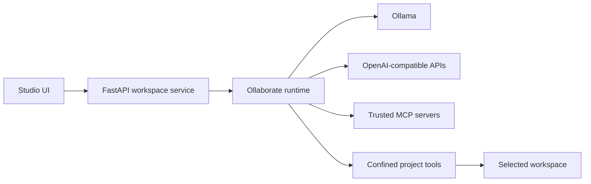

# Ollaborate Studio

An agent-first IDE prototype built around [Ollaborate](https://pypi.org/project/ollaborate/). It treats one or several agents as first-class project participants rather than adding a chat box to a conventional editor.

## What works

- Open, browse, edit, and save a local project.
- Create specialists with distinct roles, instructions, models, providers, and capabilities.
- Run Ollaborate's panel, pipeline, debate, and routing patterns.
- Use native Ollama locally without an account or API key.
- Mix Ollama with OpenAI-compatible external endpoints in the same team.
- Inspect each agent lifecycle and tool event.
- Attach trusted MCP servers to selected agents and discover their tools.
- Use the Agent Reach preset for read-only channel health and routing status.
- Keep agent tools path-confined to the selected workspace.
- Disable agent writes by default and enable them per run.

This is a proof of concept, not yet a hardened sandbox. Run the server on the loopback interface only. Agent writes are real filesystem writes when explicitly enabled; commit work before allowing them.

## Quick start

Prerequisites: Python 3.10+ and, for local models, [Ollama](https://ollama.com/).

```bash
ollama pull qwen3:8b
python -m venv .venv
. .venv/bin/activate             # Windows: .venv\Scripts\activate
pip install -e ".[dev]"
ollaborate-studio
```

Open `http://127.0.0.1:8765`, enter a project directory, and click **Open**.

## External providers

Open the provider settings and add any service exposing an OpenAI-compatible `/v1/chat/completions` endpoint. Configure the base URL through `/v1`, model name on the agent, and API key when needed. Keys are kept only in the current browser session.

## MCP plugins and Agent Reach

Install generic MCP support with:

```bash
pip install -e ".[mcp]"
```

Then install the pinned Agent Reach revision. Do not install the unrelated package with the same name from PyPI.

```bash
pip install "agent-reach @ git+https://github.com/Panniantong/Agent-Reach.git@a19a171fa980a0785849596492e0af4db800c82f"
```

Open **MCP plugins** in the activity bar, select **Agent Reach**, and use **Discover tools**. The preset starts the local stdio server with `python -m agent_reach.integrations.mcp_server`.

Agent Reach is a capability installer and health router. Its MCP server currently provides the read-only `get_status` tool. Web, YouTube, GitHub, RSS, Exa, LinkedIn, and social-platform actions remain upstream tools or separate MCP servers. Studio does not silently grant those CLIs shell access or represent them as Agent Reach MCP tools.

New MCP servers begin untrusted. Starting a server, including tool discovery, executes its command with your user permissions. **Trust tools for agent use** must therefore be enabled before discovery, and the plugin must also be assigned before an agent receives its tools.

## Architecture



The IDE depends on Ollaborate's public `Agent`, `Team`, event, and injectable-client interfaces. The external adapter implements the same small `chat()` contract as Ollama's `AsyncClient`; Ollaborate itself therefore remains Ollama-first and provider-agnostic at the boundary.

## Security model

- Server binds to `127.0.0.1` by default.
- All agent paths are resolved and checked against the chosen workspace root.
- Individual reads are limited to 1 MB.
- Agent write tools are omitted unless the user opts in for that run.
- Tool rounds and debate rounds are bounded.
- API keys are password fields and are not persisted by the UI.
- MCP servers are untrusted by default and must be explicitly assigned to an agent.
- MCP secrets use subprocess environment variables rather than command arguments.

The browser file API can still access directories available to the operating-system user. Authentication, OS/container sandboxing, command execution, extension isolation, secrets filtering, signed releases, and workspace trust are required before production use.

## Development

```bash
ruff check .
pytest
```

## Roadmap

1. Streaming events over WebSocket with cancellation.
2. Diff-first write approval rather than a run-wide write toggle.
3. Streamable HTTP MCP transport with OAuth and persistent connection pooling.
4. Embedded Monaco editor and language-server support.
5. PTY terminal with explicit command approval.
6. Git checkpoints and one-click rollback for agent actions.
7. Persisted `.ollaborate/team.json` configurations.
8. Sandboxed tools and workspace-trust policies.
9. Desktop packaging through Tauri or Electron.

## License

MIT
